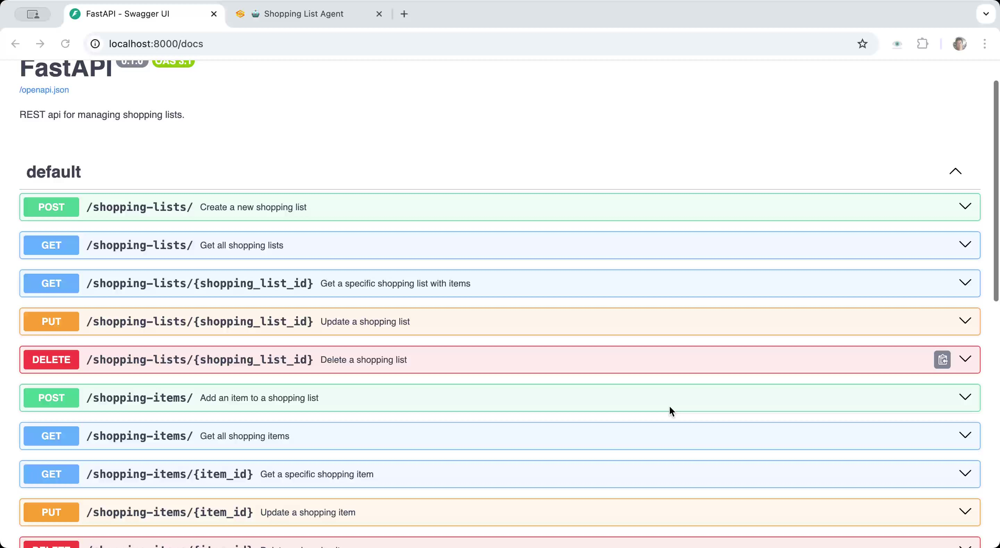

# LangGraph FastAPI MCP Server Demo

This is a sample project that turns a shopping list FastAPI app into an MCP server and connects a LangGraph based chatbot to the MCP server so that it can manage the user's shopping list via chat.

(https://github.com/davidkiss/langgraph-fastapi-mcp-server-demo/raw/refs/heads/main/docs/langgraph-fastapi-mcp-server-demo.mp4)

## Technology Stack

- **[FastAPI](https://fastapi.tiangolo.com/)**: a modern, fast (high-performance), web framework for building APIs with Python 3
- **[FastAPI-MCP](https://fastapi-mcp.tadata.com/)**: an open-source library that exposes your FastAPI endpoints as Model Context Protocol (MCP) tools (with Auth)
- **[MCP (Model Context Protocol)](https://www.anthropic.com/news/model-context-protocol)**: an open protocol that facilitates seamless interaction between AI models and external data sources or tools
- **[LangChain](https://langchain.com/)**: An opens-source framework that helps developers build applications powered by large language models (LLMs)
- **[LangGraph](https://langgraph.dev/)**: An opens-source framework by LangChain for building and managing complex AI agents using graph-based architecture
- **[ChatGPT](https://openai.com/chatgpt)**: A popular LLM provided by OpenAI
- **[Gradio](https://gradio.app/)**: A popular opens-source library for building web interfaces for machine learning models. This project uses Gradio to create a web interface for the chatbot.
- **[LangSmith](https://smith.langchain.com/)**: An opens-source framework by LangChain for tracing and monitoring LLM applications.
- **[uv](https://github.com/conda-forge/uv)**: A fast opens-source Python package manager - a drop-in replacement for `pip`, `conda` and `virtualenv`.

## Quick Start

### 1. Install `uv`

Follow the instructions [here](https://docs.astral.sh/uv/getting-started/installation/) to install `uv`, if you haven't already.

### 2. Install Dependencies

```bash
uv sync
```

### 3. Set Up OpenAI API Key

Create a `.env` file in the project root:

```bash
# .env
OPENAI_API_KEY=your-openai-api-key-here
```

### 4. Run the FastAPI app

```bash
uv run uvicorn server.main:app --host 0.0.0.0 --port 8000 --reload
```

Try the FastAPI app at `http://localhost:8000/docs`

### 5. Run the Chatbot

```bash
uv run chatbot.py
```

The chatbot will be available at `http://localhost:7860`

## Usage Examples

Try these example queries in the chatbot:

- "I need to buy a watermelon",
- "What's in my shopping list?",
- "Let's add spaghetti and tomato sauce",
- "I just bought the watermelon",
- "Remove the tomato sauce",
- "I need an extra spaghetti",

## Dependencies

- **LangGraph**: For creating the React agent
- **Gradio**: For the chat interface
- **LangChain OpenAI**: For the language model integration
- **LangChain Core**: For tool definitions
- **FastAPI**: For the MCP server
- **SQLAlchemy**: For database operations

## License

This project is open source and available under the MIT License.
